<!-- Theme-Sensitive Header Banner -->
<picture>
  <source media="(prefers-color-scheme: dark)" srcset="readmefile/dark.svg">
  <source media="(prefers-color-scheme: light)" srcset="readmefile/light.svg">
  
</picture>

 

---

## 📈 GitHub Stats & Metrics

<!-- Sleek contribution activity graph with theme sensitivity -->

  <picture>
    <source media="(prefers-color-scheme: dark)" srcset="https://github-readme-activity-graph.vercel.app/graph?username=meypanhawath&bg_color=030712&color=94A3B8&line=10B981&point=34D399&area_color=0D9488&area=true&hide_border=true&radius=12">
    <source media="(prefers-color-scheme: light)" srcset="https://github-readme-activity-graph.vercel.app/graph?username=meypanhawath&bg_color=FFFFFF&color=475569&line=0D9488&point=10B981&area_color=E6FFFA&area=true&hide_border=true&radius=12">
    
  </picture>

<!-- Stats Cards Layout -->
<table width="100%">
  <tr>
    <td width="50%" align="left">
      <picture>
        <source media="(prefers-color-scheme: dark)" srcset="https://ghstats.dev/api/langs?username=meypanhawath&layout=grid&bg=030712&title_color=10B981&text=94A3B8&icon_color=34D399&border_color=0D9488">
        <source media="(prefers-color-scheme: light)" srcset="https://ghstats.dev/api/langs?username=meypanhawath&layout=grid&bg=FFFFFF&title_color=0D9488&text=475569&icon_color=10B981&border_color=E2E8F0">
        
      </picture>
    </td>
    <td width="50%" align="right">
      <a href="https://github.com/meypanhawath" target="_blank">
        <picture>
          <source media="(prefers-color-scheme: dark)" srcset="https://streak-stats.demolab.com?user=meypanhawath&theme=dark&background=030712&stroke=0D9488&ring=10B981&fire=34D399&currStreakNum=10B981&currStreakLabel=94A3B8&sideNums=94A3B8&sideLabels=94A3B8&dates=6B7280">
          <source media="(prefers-color-scheme: light)" srcset="https://streak-stats.demolab.com?user=meypanhawath&theme=light&background=FFFFFF&stroke=E2E8F0&ring=0D9488&fire=10B981&currStreakNum=0D9488&currStreakLabel=475569&sideNums=475569&sideLabels=475569&dates=94A3B8">
          
        </picture>
      </a>
    </td>
  </tr>
  <tr>
    <td colspan="2" align="center">
      <picture>
        <source media="(prefers-color-scheme: dark)" srcset="https://ghstats.dev/api/card?username=meypanhawath&bg=030712&title_color=10B981&text=94A3B8&icon_color=34D399&border_color=0D9488">
        <source media="(prefers-color-scheme: light)" srcset="https://ghstats.dev/api/card?username=meypanhawath&bg=FFFFFF&title_color=0D9488&text=475569&icon_color=10B981&border_color=E2E8F0">
        
      </picture>
    </td>
  </tr>
</table>

---

<!-- Proudly created with GPRM ( https://gprm.itsvg.in ) -->
